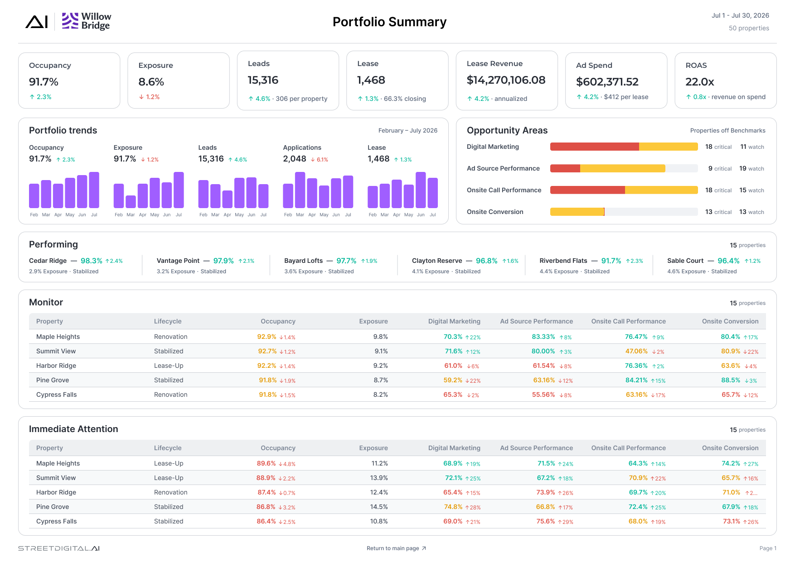

# Street Digital AI

A portfolio summary dashboard built in React + Vite for a digital property intelligence concept. The interface highlights portfolio performance, key KPIs, opportunity areas, and monitoring tables in a clean executive-reporting style.

## Preview



## Project goals

- Present a portfolio summary in a single, scannable dashboard
- Surface key performance indicators at a glance
- Compare trends, opportunity areas, and immediate attention items
- Match a Figma-inspired design system with consistent spacing, typography, and tables

## Tech stack

- React
- TypeScript
- Vite
- Mantine UI
- CSS Modules
- Playwright visual regression tests

## Local development

1. Install dependencies:
   ```bash
   npm install
   ```
2. Start the development server:
   ```bash
   npm run dev
   ```
3. Open the app in the browser at the local Vite URL shown in the terminal.

## Live preview

### Local preview

```bash
npm install
npm run dev
```

Then open the local address shown by Vite, usually:

```text
http://localhost:5173
```

### Production preview

```bash
npm run build
npm run preview -- --host 0.0.0.0
```

This serves the production build locally so you can verify the final compiled UI before deployment.

### Deployment note

This repository is private, and GitHub Pages is not available on the current GitHub plan. For a private project, use a supported external host such as Vercel or Netlify.

Typical deployment steps:

1. Push the repository to GitHub.
2. Import the repo into Vercel or Netlify.
3. Set the framework preset to Vite.
4. Use the default build command:
   ```bash
   npm run build
   ```
5. Use the output folder:
   ```text
   dist
   ```
6. Deploy and copy the generated live preview URL.

## Production build

```bash
npm run build
```

## Testing

```bash
npm run test:visual
```

## Project structure

```text
src/
  components/
  mocks/
  pages/
  theme/
  assets/
  main.tsx

design/
  reference.png

tests/
```

## Notes

This project was created to mirror a design reference and validate layout fidelity, component structure, and visual consistency in a front-end dashboard interface.
